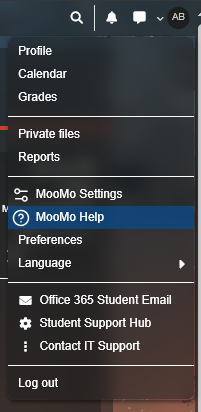
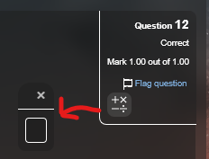
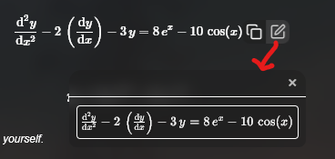

# MooMo Info

## WARNING: PLEASE READ

MooMo is still *very* experimental, many features are currently being worked on, and as such there is a high
possibility that many bugs are present. Should ANYTHING seem weird or not work as expected, disable the extension
and reload the page. Beware, some common issues are mathfields not translating into STACK as expected, which CAN
lose you marks in quizzes (USE AT YOUR OWN RISK).

If you find any bugs, please feel free to report them in our [GitHub Issues](https://github.com/wntiv-main/uclearn/issues).
Please provide a detailed description of the issue, relevant screenshots and/or the course/LM where the issue can be found.

## Accessing Help

This menu will only show up on your first load of the page. However, it can also be accessed at any time from the "MooMo Help"
button in the user profile dropdown (top right).

## MathLive fields

For math courses, often in STACK questions you will see the standard text import boxes replaced with math input fields from
[mathlive](https://cortexjs.io/mathfield/). These fields allow for a much cleaner and faster experience editing mathematical
expressions. KEEP IN MIND THESE ARE STILL EXPERIMENTAL. The keybindings and additional features these provide are many and quite
complex, if there is anything you need to input that isnt immediately obvious, check out their docs for
[Keybindings](https://cortexjs.io/mathfield/reference/keybindings/), [LaTeX commands](https://cortexjs.io/mathfield/reference/commands/),
and [Creating matrices](https://cortexjs.io/mathfield/matrix/).

### Working areas

Alongside the fields provided for answers, we allow the ability to create extra fields for a working area. These can be accessed
through the button beneath the question number:

,

or by hovering and using the 'Edit' button on any math within the page:

.

### Multiline

The fields do support multi-line through various LaTeX environments, which is especially useful in working areas. Working areas
should be multiline by default, allowing for simply pressing `Enter` to create a newline. Otherwise, `Ctrl`+`Enter` creates a
"newline" using a matrix environment. Some nuances with mathlive's multiline include needing to use `Ctrl`+`Backspace` to remove
a line. This is on mathlive's side and is not easily fixable by me.

## Code Editor

For COSC courses, you will see the coderunner question editors replaced with custom editors. Changes here include thematic
changes (temporary, working on getting proper synchronised theme support). We also attach a python LSP to the editors, which
provides autocompletion support. You should see suggestions appear as you type, or you can press `Ctrl`+`Space`. Again, this is
EXPERIMENTAL and is known to not work properly in fill-in-the-blank questions.

## Hydration

We use a technique called hydration to update the site with new data on navigation. This is what handles the loading bar you see at
the top of the page, and should provide much faster transitions between pages, especially in learning modules/quizzes. You needn't
understand this, but this involves a few things to keep in mind - namely, as this is still HIGHLY experimental, things may break. If
anything looks off after clicking a button or link, try reloading the page as this may fix the issue. If you find a common occurance
of this, please report it to our [GitHub Issues](https://github.com/wntiv-main/uclearn/issues).
